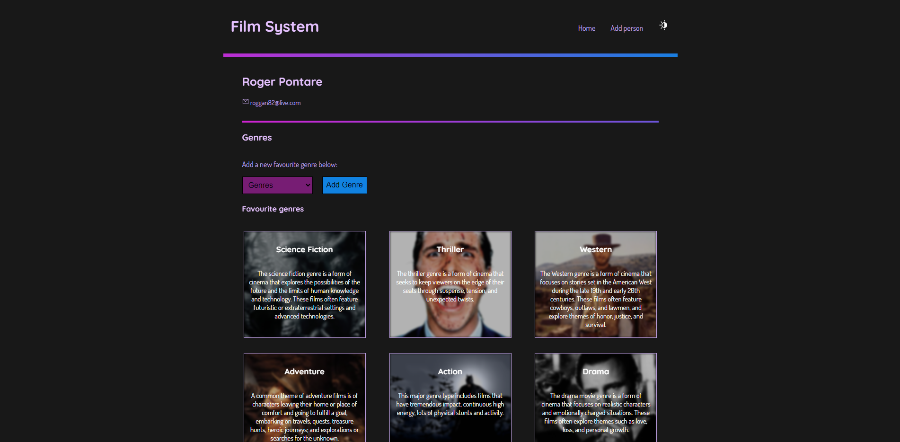

# Film-System-Client

## Overview

This web application was made with the React library.

Main objective for this project was to build a web client which can be used for making various API requests developed in my previous project (Film-System-API).

TMDB (The Movie Database) is the source for the an external API used in the development of this web app.

Feel free to visit their website:
<picture>

</picture>

## Web App

As a user of this web application you are able to add a person which then will be displayed in the front page. Each person added are clickable and will redirect the user to a personal profile.

Within each profile you are able to:

- Add a favourite genre
- Add a new movie
- Rate an added movie
- View all genres
- View all movies added
- View rating of a movie

All of these functions are possible by utilizing the <a href="https://github.com/lordstimpa/Film-System-API">Film-System-API</a> created by myself.

### Profile of a registered user of the application:

<picture>

</picture>

## Reflection

The things that can be improved/added in this project are as follows:

1. Add posters to each movie in personal profiles
2. Prevent default page reload once a form has been submitted
3. Add a functional search bar for existing users and movies
4. Add a login/register function (databases & API has to be adjusted for this to be possible)

During the building of this web client I have finally been able to close the gap between frontend and backend development. By creating a local database and made a fully functional API used for communicating between the client and server side I can with confidence declare myself a fullstack developer.

## Tools

All of the tools used during the development of this program:

#### Integrated Development Environment (IDE)

- Visual Studio Code

#### Dependencies / Packages

- React 18.2.0
- Axios 1.4.0
- React router dom 6.11.1
- Styled components 5.3.10
- Vite 4.3.2

#### Languages

- HTML5
- CSS
- JavaScript
